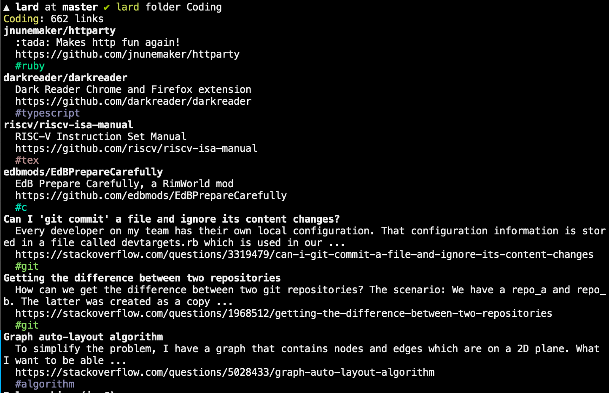

# Lard

:green_book: A third-party command line interface for larder.io

Note: This project is a work-in-progress, and as such, may not be fully functional quite yet. Note this also means patch versions in the `0.0.z` release family can be major breaking changes. Until we reach a `0.1.0`, upgrade at your own risk!

## Installation

To install, simply run `gem install lard`. Then, you can run the binary by calling `lard`.

You'll need to log in before you can do much, so follow instructions in `lard login` to get started.

## Contributing

I welcome contributions of all kinds! Feel free to open an issue to discuss problems, feature requests, smoothie flavors, or code changes you'd like to make. This project is meant to be useful to every Larder user, so I'd love to hear from you!

If you want to run the code locally, follow these steps:

1. Clone the repo
2. Make sure you have a supported ruby version
3. Install dependencies with `bundle install`
4. Build the gem with `gem build`
5. Install the gem locally with `gem install --local lard-x.y.z.gem` where `x.y.z` is the version triple

For brownie points you can install the `rubocop` gem and try to make sure you limit the warnings that crop up from `rubocop`, but don't sweat it since Travis CI will run this for you if you don't!

## Features

Checked boxes represent minimally viable completed features, meaning they are feature complete but may leave room for future improvement:

- [x] Log in with your application token in a config file
- [x] Log in via command line function to populate above above config file
- [x] List all of your folders
- [x] List all of the bookmarks in a folder
- [x] Search for specific bookmarks
- [x] Create a new bookmark
- [x] Edit existing bookmarks
- [x] List all tags
- [ ] Export bookmarks
- [ ] Import bookmarks
- [ ] Operate offline via cache
